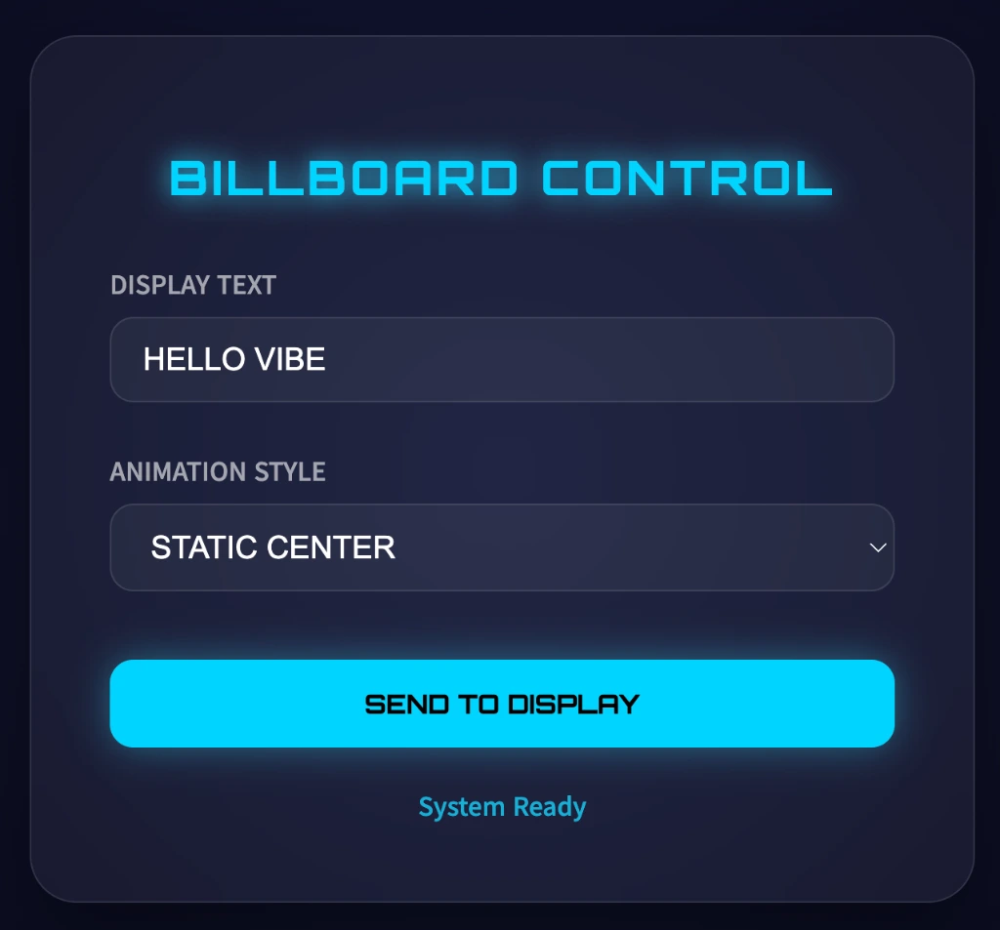
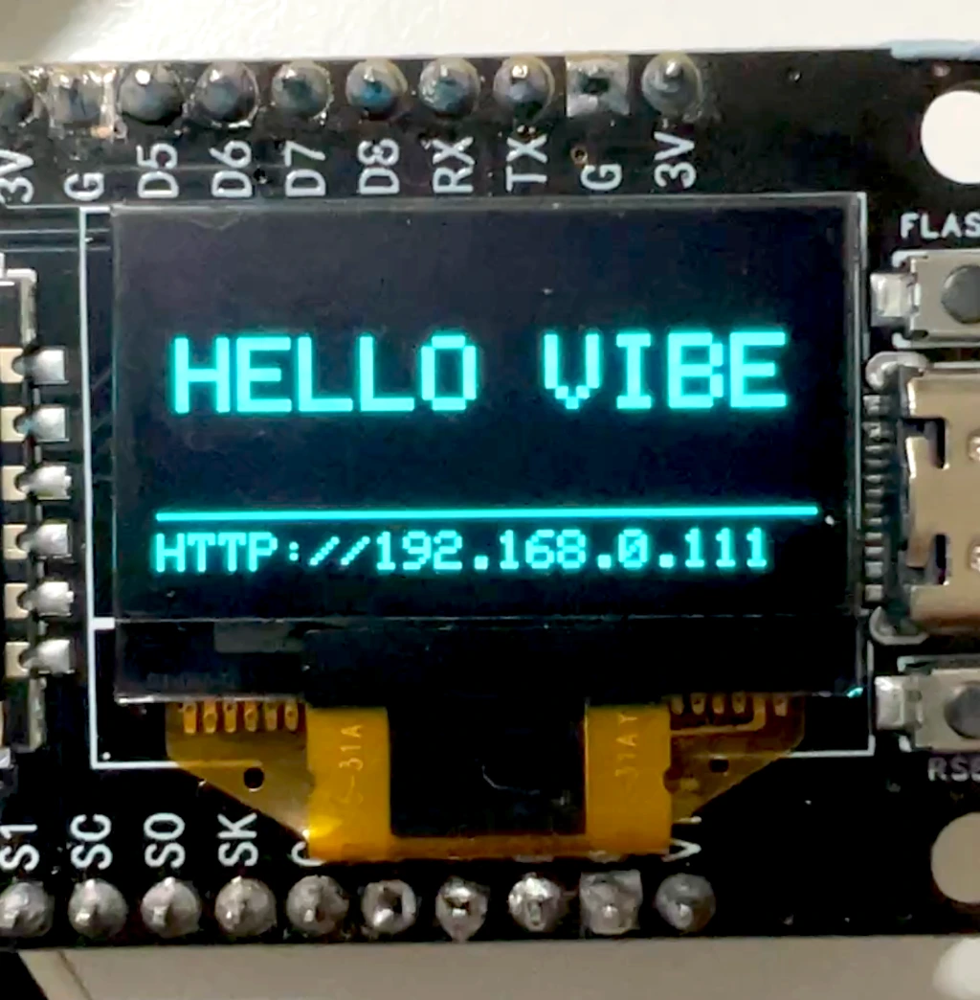

# 📟 ESP8266 IoT Mini Billboard

ESP8266과 0.96" OLED를 활용한 **웹 제어 기반 스마트 전광판** 프로젝트입니다. 스마트폰이나 PC의 웹 브라우저를 통해 원하는 문장과 애니메이션을 실시간으로 디스플레이에 전송할 수 있습니다.

## ✨ 주요 특징 (Key Features)

- **Web UI Control**: ESP8266의 IP로 접속하여 텍스트를 즉시 변경 가능.
- **Vibrant Animations**: 5가지의 역동적인 텍스트 애니메이션 제공.
- **Premium Aesthetics**: 프리미엄 글래스모피즘(Glassmorphism) 디자인의 웹 대시보드.
- **mDNS 지원**: `http://billboard.local`로 간편하게 접속 가능 (네트워크 환경에 따라 상이).

## 📸 Preview

| Web Dashboard | Physical Display |
| :---: | :---: |
|  |  |

## 🚀 시작하기 (Getting Started)

### 1. WiFi 설정
`include/config.h` 파일을 열어 자신의 WiFi 정보를 입력합니다.
```cpp
const char* WIFI_SSID = "WiFi_이름";
const char* WIFI_PASSWORD = "비밀번호";
```

### 2. 업로드
PlatformIO를 사용하여 코드를 빌드하고 ESP8266에 업로드합니다.

### 3. 접속 및 제어
1. 시리얼 모니터(74880 baud) 또는 OLED 액정에 표시된 **IP 주소**를 확인합니다.
2. 같은 WiFi에 연결된 PC/스마트폰 브라우저에서 해당 IP 주소에 접속합니다.
3. 원하는 문장을 입력하고 애니메이션을 선택한 후 **SEND TO DISPLAY** 버튼을 누릅니다.

## 🎭 제공되는 애니메이션 (Animations)

1. **STATIC CENTER**: 화면 중앙에 텍스트를 고정합니다.
2. **SMOOTH SCROLL**: 오른쪽에서 왼쪽으로 부드럽게 흐르는 전광판 효과입니다.
3. **NEON BLINK**: 네온사인처럼 깜빡이며 시선을 끄는 효과입니다.
4. **CYBER TYPEWRITER**: 커서와 함께 한 글자씩 타이핑되는 효과입니다.
5. **PULSE SYNC**: 텍스트가 심장 박동처럼 커졌다 작아지는 효과입니다.

## 💻 웹 시뮬레이터 (Simulator)
`index.html` 파일을 브라우저로 열면 실제 하드웨어가 없어도 동일한 기능을 미리 체험해 볼 수 있습니다.

---
_Created with ❤️ by Antigravity_
